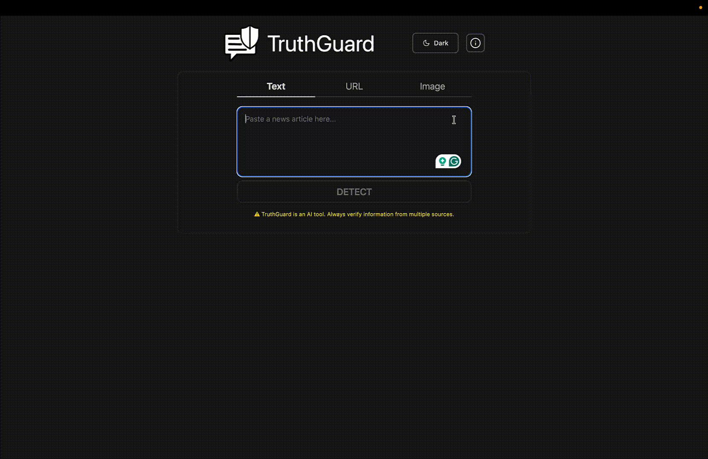

# TruthGuard

**🎉 Winner of the 2023 Congressional App Challenge 🎉**

Try out TruthGuard at [https://truthguard.app/](https://truthguard.app/)

[Read about TruthGuard as a winner of the Congressional App Challenge!](https://www.congressionalappchallenge.us/23-ga05/)

TruthGuard is an AI-powered fake news detector that detects misinformation and bias to combat the spread of misinformation. TruthGuard empowers you to separate fact from fiction and protect the trustworthiness of the information you consume.

The TruthGuard model was built with PyTorch and the frontend using React JS and Tailwind CSS. The model architecture consists of a Transformer Encoder with a classification head. The TruthGuard server uses Python and FastAPI.
