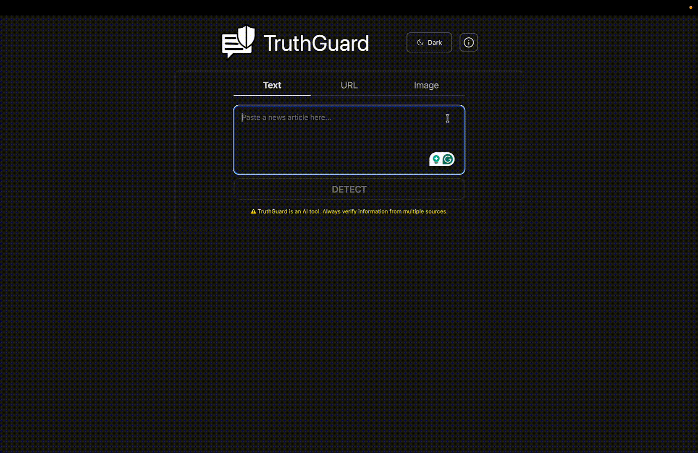

# TruthGuard

**Winner of the 2023 Congressional App Challenge**

> AI-powered fake news detector that detects misinformation and bias to combat the spread of misinformation. TruthGuard empowers you to separate fact from fiction and protect the trustworthiness of the information you consume.



[Try TruthGuard](https://truthguard.app/) | [Congressional App Challenge Winner](https://www.congressionalappchallenge.us/23-ga05/)

---

## Table of Contents

- [Features](#features)
- [Architecture](#architecture)
- [Project Structure](#project-structure)
- [Getting Started](#getting-started)
  - [Prerequisites](#prerequisites)
  - [Clone the Repository](#clone-the-repository)
  - [Server Setup](#server-setup)
  - [Client Setup](#client-setup)
  - [Chrome Extension Setup](#chrome-extension-setup)
- [Model Details](#model-details)

---

## Features

- **Text Analysis** — Paste any article or news text to get a real-time credibility score
- **URL Scraping** — Enter a URL and TruthGuard automatically extracts and analyzes the article content
- **Image OCR** — Upload a screenshot of an article and TruthGuard extracts the text using Tesseract.js for analysis
- **Chrome Extension** — Analyze articles directly from your browser without leaving the page

---

## Architecture

TruthGuard is a 3-tier application:

```
┌──────────────────────────────────────────────────────┐
│                     Frontend                         │
│         React + Vite + Tailwind CSS                  │
│     (Web App & Chrome Extension)                     │
│                                                      │
│  ┌─────────────┐  ┌──────────┐  ┌────────────────┐  │
│  │ Text Input  │  │ URL Input│  │ Image OCR      │  │
│  │             │  │          │  │ (Tesseract.js) │  │
│  └──────┬──────┘  └────┬─────┘  └───────┬────────┘  │
└─────────┼──────────────┼────────────────┼────────────┘
          │              │                │
          ▼              ▼                ▼
┌──────────────────────────────────────────────────────┐
│                    Backend                           │
│              FastAPI + ONNX Runtime                  │
│                                                      │
│  ┌──────────────────┐  ┌──────────────────────────┐  │
│  │ POST /predict    │  │ POST /scrape             │  │
│  │ (classification) │  │ (BeautifulSoup scraping) │  │
│  └──────────────────┘  └──────────────────────────┘  │
└────────────────────────┼─────────────────────────────┘
                         │
                         ▼
┌──────────────────────────────────────────────────────┐
│                     Model                            │
│       DistilBERT-based Binary Classifier             │
│       Quantized ONNX (INT8) for fast inference       │
│       Hosted on Hugging Face Hub                     │
└──────────────────────────────────────────────────────┘
```

---

## Project Structure

```
TruthGuard/
├── client/                        # Web application (React + Vite)
│   ├── src/
│   │   ├── App.jsx                #   Main application component
│   │   ├── main.jsx               #   Entry point
│   │   └── index.css              #   Global styles (Tailwind)
│   ├── public/                    #   Static assets & icons
│   ├── dist/                      #   Production build output
│   ├── .env                       #   Environment variables
│   ├── vite.config.js             #   Vite configuration
│   └── package.json
│
├── chrome-extension/              # Chrome browser extension
│   ├── src/
│   │   ├── App.jsx                #   Extension popup component
│   │   ├── main.jsx               #   Entry point
│   │   └── index.css              #   Styles
│   ├── manifest.json              #   Chrome extension manifest (v3)
│   ├── dist/                      #   Built extension (ready to load)
│   ├── TruthGuardExtension.zip    #   Packaged extension
│   ├── vite.config.js
│   └── package.json
│
├── server/                        # FastAPI backend
│   ├── main.py                    #   API endpoints (/predict, /scrape)
│   ├── requirements.txt           #   Python dependencies
│   ├── Procfile                   #   Deployment configuration
│   └── LICENSE
│
├── model/                         # ML model & training data
│   ├── final_model/
│   │   └── truth_guard_model.pt   #   Trained PyTorch model
│   ├── onnx_model/
│   │   ├── truth_guard.onnx       #   ONNX model (full precision)
│   │   └── truth_guard_int8.onnx  #   ONNX model (INT8 quantized)
│   ├── kaggle/                    #   Kaggle Fake News dataset
│   ├── liar2/                     #   LIAR-2 dataset
│   └── truth-guard-training.ipynb #   Training notebook
│
└── README.md
```

---

## Getting Started

### Clone the Repository

```bash
git clone https://github.com/RishabA/TruthGuard.git
cd TruthGuard
```

### Server Setup

```bash
cd server

# Install dependencies
pip install -r requirements.txt

# Start the server
uvicorn main:app --reload --port 8000
```

The API will be available at `http://localhost:8000`.

### Client Setup

```bash
cd client

# Install dependencies
npm install

# Configure the server URL
# Edit .env and set: VITE_SERVER_URL=http://localhost:8000

# Start the development server
npm run dev
```

The web app will be available at `http://localhost:5173`.

### Chrome Extension Setup

```bash
cd chrome-extension

# Install dependencies
npm install

# Configure the server URL
# Edit .env and set: VITE_SERVER_URL=http://localhost:8000

# Build the extension
npm run build
```

Then load the extension in Chrome:

1. Navigate to `chrome://extensions/`
2. Enable **Developer mode** (toggle in top-right)
3. Click **Load unpacked**
4. Select the `chrome-extension/dist/` folder

---

## Model Details

TruthGuard uses a **DistilBERT-based binary classifier** trained to distinguish between real and fake news articles.

| Property               | Value                                                         |
| ---------------------- | ------------------------------------------------------------- |
| **Base Tokenizer**     | `distilbert-base-uncased`                                     |
| **Architecture**       | Transformer Encoder + Classification Head                     |
| **Training Framework** | PyTorch                                                       |
| **Inference Runtime**  | ONNX Runtime (CPU)                                            |
| **Quantization**       | INT8 (for production)                                         |
| **Max Input Length**   | 512 tokens                                                    |
| **Output**             | Sigmoid probability (0.0 = Real, 1.0 = Fake)                  |
| **Training Data**      | Kaggle Fake News Dataset, LIAR-2 Dataset                      |
| **Model Hosting**      | [Hugging Face Hub](https://huggingface.co/RishabA/TruthGuard) |

The training process is documented in `model/truth-guard-training.ipynb`.

---

## API Endpoints

| Method | Endpoint   | Description                        | Request Body        |
| ------ | ---------- | ---------------------------------- | ------------------- |
| POST   | `/predict` | Classify text as real or fake news | `{ "text": "..." }` |
| POST   | `/scrape`  | Scrape article content from a URL  | `{ "url": "..." }`  |
